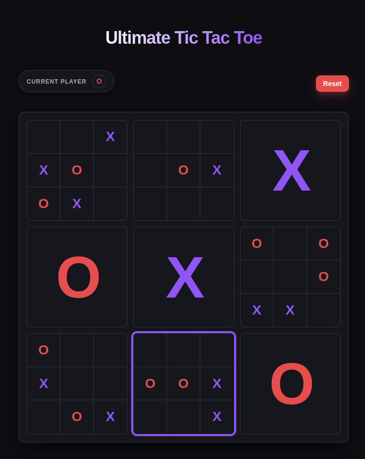

# 🎮 Ultimate Tic Tac Toe

Uma versão avançada e estratégica do clássico Jogo da Velha, desenvolvida com TypeScript e Vite.



## 📋 Sobre o Jogo

Ultimate Tic Tac Toe é uma variação complexa do jogo da velha tradicional. Em vez de jogar em um único tabuleiro 3x3, você joga em um tabuleiro principal composto por 9 tabuleiros menores 3x3.

## 🎯 Regras do Jogo

### Objetivo
Vencer 3 tabuleiros pequenos em linha (horizontal, vertical ou diagonal) no tabuleiro principal.

### Como Jogar

1. **Início do Jogo**
   - O jogador X sempre começa
   - O primeiro jogador pode escolher qualquer célula em qualquer tabuleiro

2. **Mecânica Principal**
   - Quando você marca uma célula em um tabuleiro pequeno, você determina em qual tabuleiro o próximo jogador deve jogar
   - **Regra de Ouro**: A posição da célula que você marca corresponde ao tabuleiro onde o adversário deve jogar
   
   **Exemplo**: Se você marcar a célula superior direita (posição 2) de um tabuleiro, seu adversário deve jogar no tabuleiro superior direito (tabuleiro 2) do tabuleiro principal.

3. **Vencendo um Tabuleiro Pequeno**
   - Para vencer um tabuleiro pequeno, você precisa fazer 3 em linha (como no jogo da velha tradicional)
   - Quando um tabuleiro é vencido, ele é marcado com o símbolo do vencedor (X ou O)
   - Tabuleiros vencidos não podem mais receber jogadas

4. **Escolha Livre de Tabuleiro**
   - Se você for enviado para um tabuleiro que já foi vencido, você pode escolher **qualquer tabuleiro disponível**
   - Um alerta visual aparecerá indicando que você pode jogar em qualquer lugar

5. **Vitória Final**
   - O jogo termina quando um jogador vence 3 tabuleiros pequenos em linha no tabuleiro principal
   - As combinações vencedoras são:
     - 3 horizontais: [0,1,2], [3,4,5], [6,7,8]
     - 3 verticais: [0,3,6], [1,4,7], [2,5,8]
     - 3 diagonais: [0,4,8], [2,4,6]

### Indicadores Visuais

- **Tabuleiro Ativo**: O tabuleiro onde você deve jogar fica destacado
- **Jogador Atual**: Exibido no topo da tela
- **Alerta de Escolha Livre**: Aparece quando você pode jogar em qualquer tabuleiro
- **Tabuleiros Vencidos**: Ficam marcados com um X ou O grande

## 🚀 Tecnologias

- **TypeScript**: Linguagem principal
- **Vite**: Build tool e dev server
- **Pattern Observer**: Para gerenciamento de estado
- **CSS3**: Estilização e animações
- **HTML5**: Estrutura

## 🛠️ Instalação e Execução

### Pré-requisitos
- Node.js (versão 16 ou superior)
- pnpm (ou npm/yarn)

### Comandos

```bash
# Instalar dependências
pnpm install

# Executar em modo de desenvolvimento
pnpm dev

# Build para produção
pnpm build

# Preview da build de produção
pnpm preview
```

## 🎨 Funcionalidades

- ✅ Jogo completo de Ultimate Tic Tac Toe
- ✅ Detecção automática de vitória
- ✅ Indicador visual do tabuleiro ativo
- ✅ Alternância entre jogadores
- ✅ Botão de reset para reiniciar o jogo
- ✅ Modal de vitória
- ✅ Tema claro/escuro
- ✅ Interface responsiva

## 📁 Estrutura do Projeto

```
src/
├── core/           # Padrão Observer (Subject/Observer)
├── engine/         # Lógica do jogo
│   ├── game.ts     # Classe principal do jogo
│   ├── player.ts   # Enum de jogadores
│   └── game_state.ts # Interface de estado
├── css/            # Estilos
├── render.ts       # Renderização HTML
├── theme.ts        # Alternância de tema
└── main.ts         # Ponto de entrada
```

## 🎓 Estratégias

- Tente controlar o centro do tabuleiro principal (tabuleiro 4)
- Pense sempre uma jogada à frente: onde você quer que seu adversário jogue?
- Evite enviar seu adversário para tabuleiros que ele pode vencer facilmente
- Priorize vencer tabuleiros estratégicos que formam linhas no tabuleiro principal

## 📝 Licença

Projeto privado para fins educacionais.

---

Desenvolvido com ❤️ usando TypeScript
